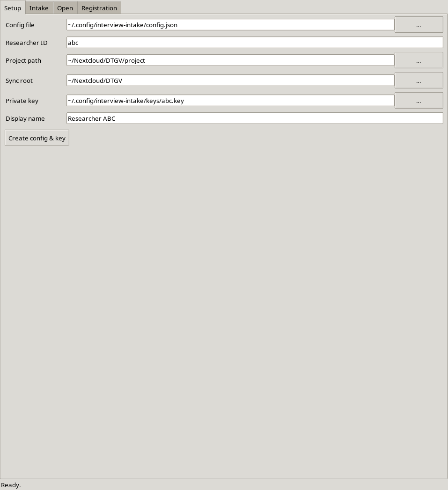
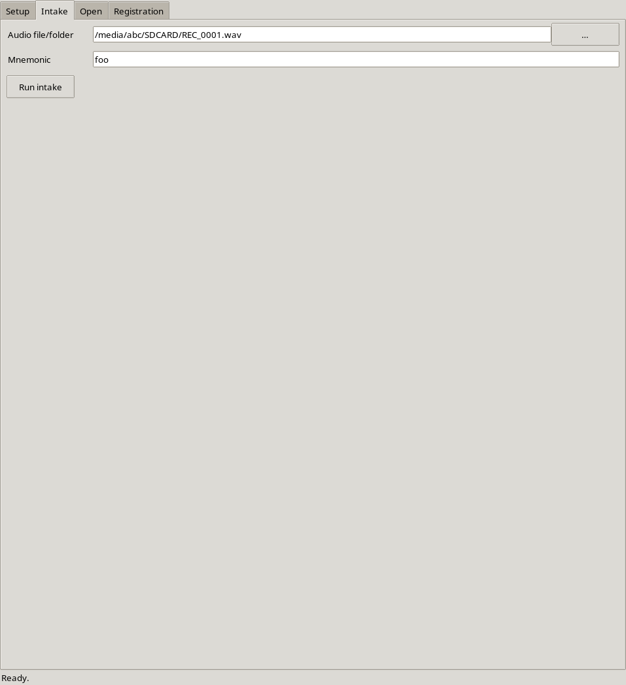
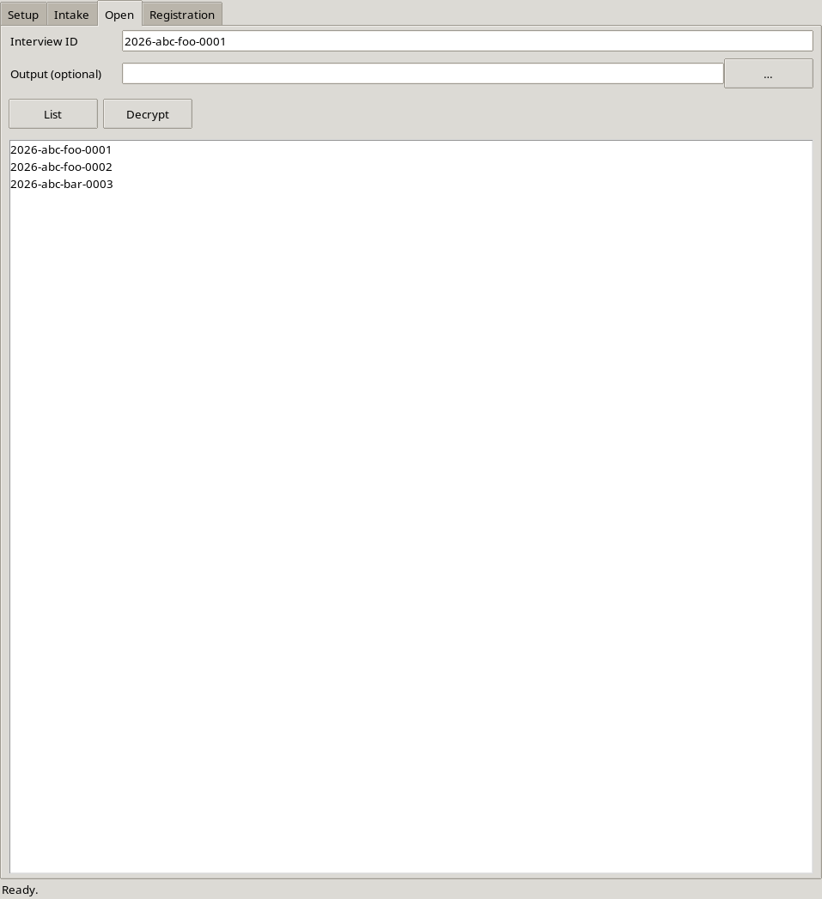
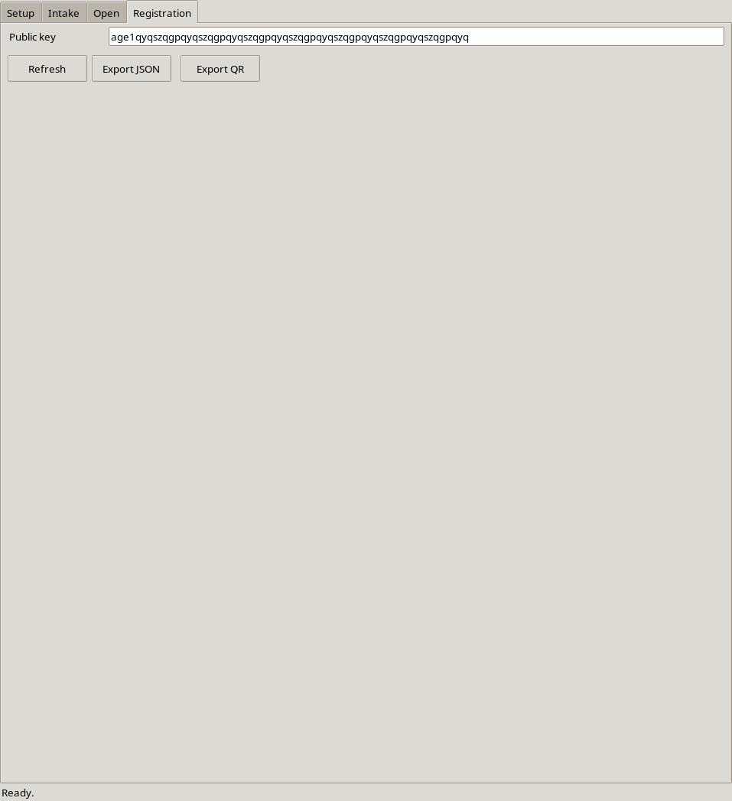
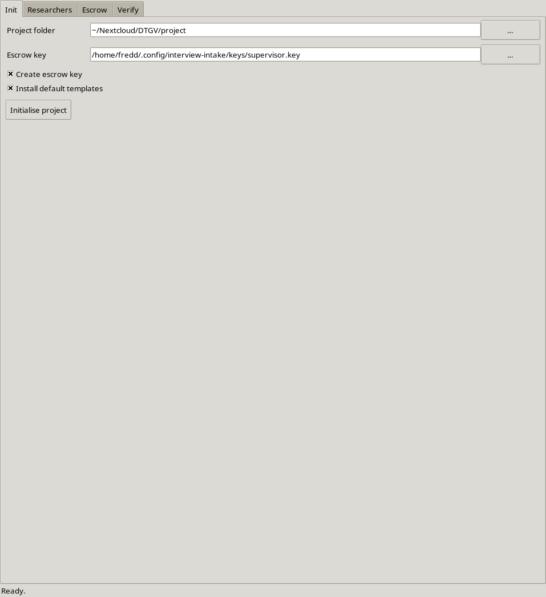
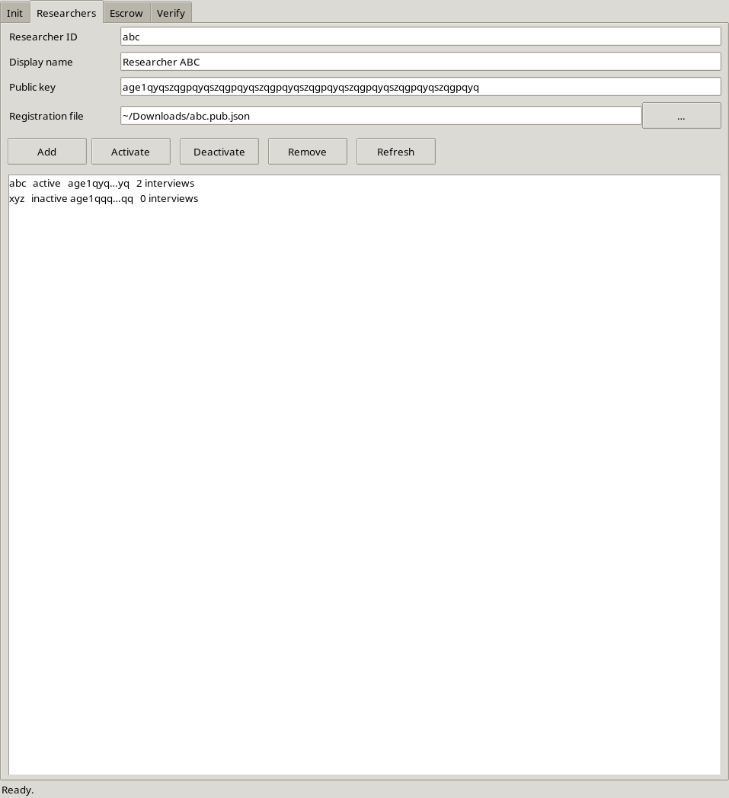
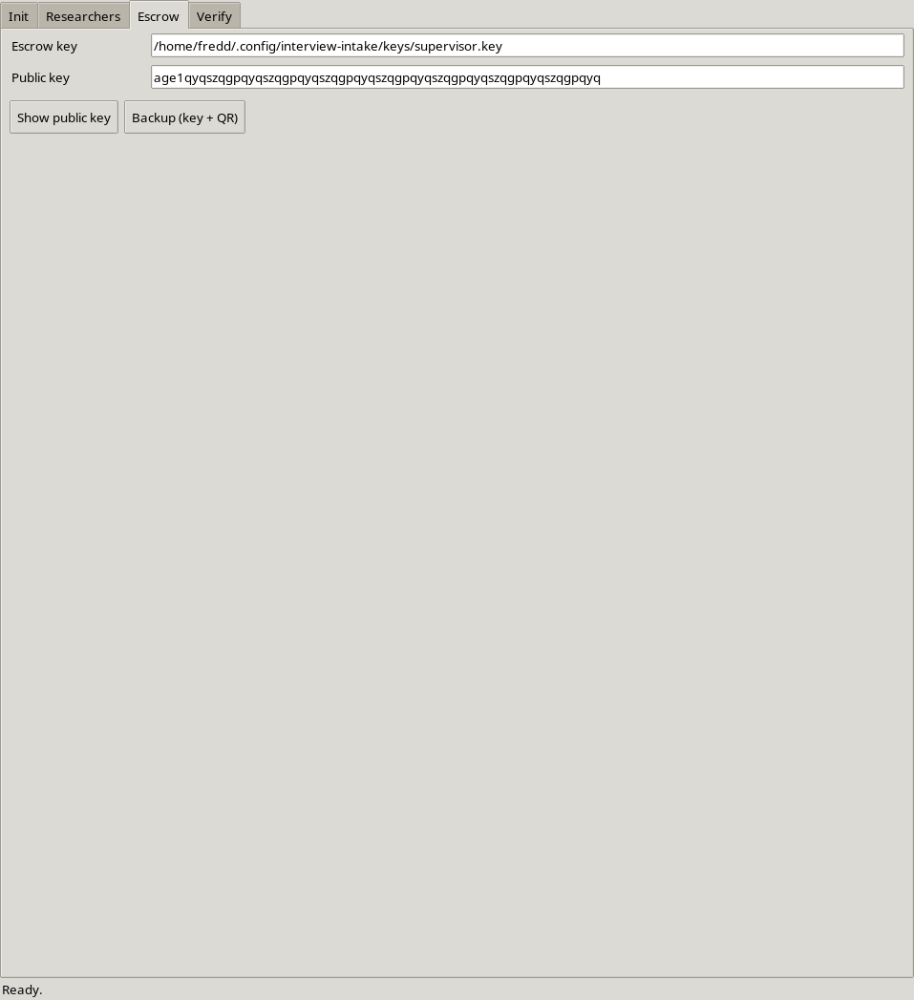
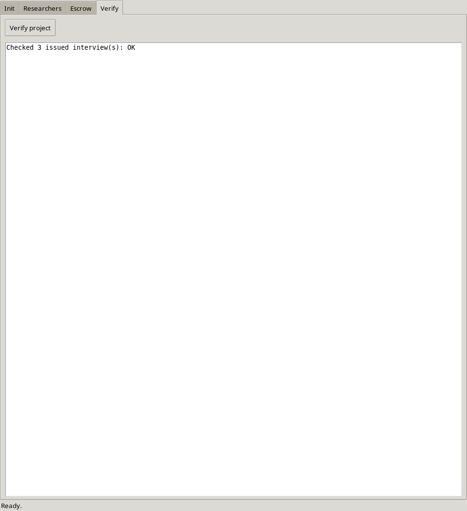

# Desktop apps (GUI)

Both roles ship an optional Tk GUI. It is a thin layer over the same core; the
CLI remains fully supported and is the canonical automation path (see
[usage.md](usage.md)).

```bash
pip install -e '.[pyrage,duration,qr]'   # Tk itself ships with Python / the OS
interview-intake-gui                     # researcher app
interview-supervisor-gui                 # supervisor app
```

| App | Entry point | Tabs |
|---|---|---|
| Researcher | `interview-intake-gui` | **Setup** (config + key + registration file/QR), **Intake** (file/folder picker, mnemonic, encrypt), **Open** (list, decrypt, open), **Registration** (export/QR public key). |
| Supervisor | `interview-supervisor-gui` | **Init** (create project + escrow + registry), **Researchers** (add from key or `registration.json`, activate/deactivate/remove, list), **Escrow** (show public key, backup with QR), **Verify** (integrity + registry checks). |

## Researcher app — example walkthrough

| Setup | Intake |
|---|---|
|  |  |
| **Open** | **Registration** |
|  |  |

1. **Setup** — fill in the config path (default `~/.config/interview-intake/config.json`),
   researcher ID (`abc`), project folder, sync root, private key path and a
   display name, then click **Create config & key**.
   This writes `config.json`, generates the age key **only if it does not exist
   yet**, and writes `registration/abc.pub.json`. The public key then shows up
   on the **Registration** tab.

   ```bash
   # CLI equivalent
   interview-intake setup --researcher-id abc \
     --project-path ~/Nextcloud/DTGV/project \
     --sync-root ~/Nextcloud/DTGV \
     --display-name "Researcher ABC"
   ```

2. **Registration** — click **Refresh** to load the key, then **Export JSON** to
   send `abc.pub.json` to the supervisor, or **Export QR** for an offline/paper
   handover.

   ```bash
   interview-intake registration --qr --qr-out registration/abc.svg
   ```

3. **Intake** — pick the audio file or folder, type the 3-letter mnemonic
   (`foo`), click **Run intake**. The status bar shows the new ID
   (`2026-abc-foo-0001`).

   ```bash
   interview-intake intake /media/abc/SDCARD/REC_0001.wav -m foo
   ```

4. **Open** — click **List** to fill the interview list, select an ID (optionally
   an output path) and **Decrypt**. The plaintext is opened with the OS player.

   ```bash
   interview-intake open --list
   interview-intake open 2026-abc-foo-0001
   ```

## Supervisor app — example walkthrough

| Init | Researchers |
|---|---|
|  |  |
| **Escrow** | **Verify** |
|  |  |

1. **Init** — choose the shared project folder, keep *Create escrow key* and
   *Install default templates* checked, click **Initialise project**. This owns
   `registry.json` (the researcher side never creates it).

   ```bash
   interview-supervisor init -p ~/Nextcloud/DTGV/project
   ```

2. **Researchers** — point *Registration file* at the researcher's
   `abc.pub.json` and click **Add** (or fill *Researcher ID* + *Public key*).
   **Activate** / **Deactivate** / **Remove** manage lifecycle; **Refresh**
   lists everyone with interview counts.

   ```bash
   interview-supervisor researcher add --from ~/Downloads/abc.pub.json
   interview-supervisor researcher list
   ```

3. **Escrow** — **Show public key** prints it; **Backup (key + QR)** writes the
   private escrow key plus public/secret QR images for a safe offline copy.

   ```bash
   interview-supervisor escrow backup --out ~/escrow-backup
   ```

4. **Verify** — **Verify project** prints the integrity report (files, hashes,
   registry consistency).

   ```bash
   interview-supervisor verify -p ~/Nextcloud/DTGV/project
   ```

## GUI notes

- **Tk is required for the GUI but never for the core.** Importing
  `interview_intake.gui` / `.supervisor_gui` succeeds even without Tk; launching
  without Tk or a display prints a clear error and exits non-zero.
- On Linux install `python3-tk`. The macOS python.org installer bundles Tk;
  Homebrew users may need `brew install python-tk@3.11`.
- Drag-and-drop is an *optional* enhancement (`pip install -e '.[gui-dnd]'`).
  Without `tkinterdnd2` the native file pickers still work.
- The researcher GUI never creates `registry.json`; only the supervisor app does.
- Keys are only created if missing, so re-running **Create config & key** is safe.
  To deliberately *rotate* a key, use the CLI with `--force`.

## Regenerating the screenshots

The screenshots above are generated with:

```bash
python scripts/capture_gui_screenshots.py
```

It needs an X display, `tkinter` and ImageMagick `import` (or `xwd` + `convert`).
