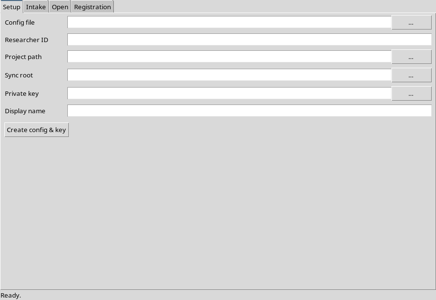
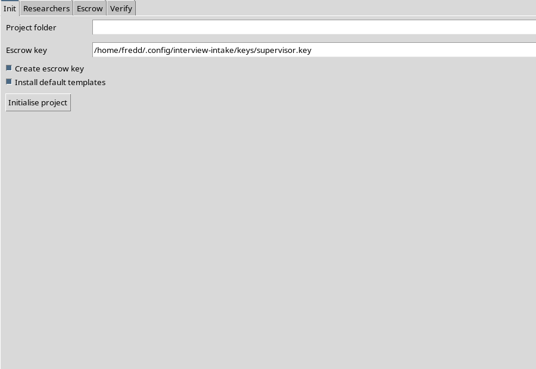

# Packaging the desktop apps

This directory turns the `interview_intake` package into **standalone desktop
deliverables** for the two roles, so end users need neither `pip` nor a `venv`:

| Role | macOS | Linux |
|---|---|---|
| Researcher | `Interview Intake.app` + `Interview Intake-<ver>.dmg` | `Interview Intake/` bundle, `Interview Intake-<ver>-x86_64.AppImage`, `interview-intake_<ver>_amd64.deb` |
| Supervisor | `Interview Supervisor.app` + `Interview Supervisor-<ver>.dmg` | `Interview Supervisor/` bundle, `Interview Supervisor-<ver>-x86_64.AppImage`, `interview-supervisor_<ver>_amd64.deb` |

Each bundle contains **two binaries that share one dependency set**:

- a console CLI (`interview-intake` / `interview-supervisor`), and
- a windowed GUI (`Interview Intake` / `Interview Supervisor`).

The files here are build **recipes only**:

```
packaging/
├── _spec_common.py            # shared PyInstaller Analysis/EXE/COLLECT/BUNDLE wiring
├── interview-intake.spec      # researcher app (CLI + GUI)
├── interview-supervisor.spec  # supervisor app (CLI + GUI)
├── entry/                     # top-level entry scripts (frozen __main__)
├── build_macos.sh             # .app -> .dmg
├── build_linux.sh             # onedir -> .AppImage / .deb
├── desktop/                   # .desktop launchers for Linux
├── icons/                     # lab art (source) + generated PNG/ICNS per role
├── make_icons.py              # regenerate icons/ from the source art
└── README.md
```

## Prerequisites

- **Python 3.11+** for every platform.
- The build extras:
  ```bash
  pip install -e '.[pyrage,qr,packaging]'
  ```
  `pyrage` and `qrcode` are bundled into the app; `pyinstaller` performs the
  freeze. `tkinterdnd2` is optional and only bundled when installed.
- **macOS**: Xcode command-line tools (`xcode-select --install`); optionally
  `brew install create-dmg` for a nicer disk-image layout.
- **Linux**: `python3-tk` (Tk is not in the base interpreter) and `binutils`
  (for `strip`). `appimagetool` / FUSE are only needed for `--appimage`, and
  `dpkg-deb` only for `--deb`.

## App icons

All roles use the lab mark in `icons/icon-orange.png` (vector master:
`icons/icon-orange.svg`). The committed derived files are:

| File | Used by |
|---|---|
| `icons/interview-intake.png`, `icons/interview-supervisor.png` | Linux `.desktop`, AppImage, `.deb` (256x256) |
| `icons/interview-intake.icns`, `icons/interview-supervisor.icns` | macOS `.app` bundle (multi-resolution) |

To change the branding, replace `icons/icon-orange.png` (square, >= 512px)
and regenerate - Pillow is only needed for this step:

```bash
python -m pip install pillow
python packaging/make_icons.py
```

The generated files are committed, so normal builds never need Pillow.

## macOS: `.app` + `.dmg`

```bash
packaging/build_macos.sh                 # both apps -> .app + .dmg
packaging/build_macos.sh --app-only      # skip the .dmg step
PYTHON=python3.11 packaging/build_macos.sh --version 0.2.0 --dist-dir release/
```

Outputs land in `dist/` (or `--dist-dir`):

```
dist/Interview Intake.app
dist/Interview Intake-0.1.0.dmg
dist/Interview Supervisor.app
dist/Interview Supervisor-0.1.0.dmg
```

DMGs are created with `create-dmg` when it is on `PATH`, and with
`hdiutil create` otherwise. The `.dmg` filename requires macOS; pass
`--app-only` if you only want the bundles.

### Signing and notarization (optional)

Unsigned apps trigger Gatekeeper ("cannot be opened because the developer
cannot be verified"). To sign and notarize:

```bash
# one-time: store notarytool credentials in the keychain
xcrun notarytool store-credentials "interview-notary" \
  --apple-id you@example.com --team-id TEAMID --password APP_PASSWORD

CODESIGN_IDENTITY="Developer ID Application: Your Name (TEAMID)" \
NOTARY_PROFILE="interview-notary" \
  packaging/build_macos.sh
```

`CODESIGN_IDENTITY` alone signs the `.app` bundles. Adding `NOTARY_PROFILE`
zips, submits with `notarytool --wait`, and staples the ticket. Set both in the
`release.yml` workflow secrets to ship notarized builds from CI.

## Linux: onedir + `.AppImage` + `.deb`

```bash
packaging/build_linux.sh             # PyInstaller onedir bundles only
packaging/build_linux.sh --appimage  # + .AppImage
packaging/build_linux.sh --deb       # + .deb
packaging/build_linux.sh --all        # + both
```

Outputs:

```
dist/Interview Intake/                       # runnable directory
dist/Interview Intake-0.1.0-x86_64.AppImage
dist/interview-intake_0.1.0_amd64.deb
dist/Interview Supervisor/ ...
```

The AppImage is assembled manually: an AppDir is populated with the frozen
bundle plus `AppRun`, a `.desktop` entry and an icon from `icons/`, then
`appimagetool` packs it. `linuxdeploy` is *not* required. `.deb` packages are
built with `dpkg-deb --build --root-owner-group`.

## Running the frozen apps

The `dist/*.AppImage` files are self-contained: run (or double-click) them and
the GUI starts with the same configuration and key locations as the `pip`
install. The screenshots below are the actual frozen binaries on Linux.

| Researcher AppImage | Supervisor AppImage |
|---|---|
|  |  |

The GUIs still read `~/.config/interview-intake/config.json`; freezing changes
nothing about config or key locations (see the main README). The bundled
console binaries accept the usual CLI flags:

```bash
"dist/Interview Intake/Interview Intake"            # GUI
"dist/Interview Intake/interview-intake" --help      # CLI
```

## CI

`.github/workflows/release.yml` builds both platforms from a tag (or a manual
`workflow_dispatch`) and uploads the `.dmg`, `.AppImage`, `.deb` and raw
directory bundles as workflow artifacts. macOS code signing is enabled only
when the relevant secrets are configured.

## Troubleshooting

- **`PyInstaller missing`** — install the extras as shown above in the same
  interpreter you invoke the build script with (`PYTHON=...`).
- **`ModuleNotFoundError: tkinter` at build time (Linux)** — install
  `python3-tk`; the freeze needs the Tcl/Tk shared libraries.
- **`appimagetool not found`** — download it from the
  [AppImageKit releases](https://github.com/AppImage/appimagetool/releases),
  `chmod +x`, and put it on `PATH`, or drop `--appimage`.
- **Gatekeeper blocks the `.app`** — either sign/notarize (above) or, for local
  testing, `xattr -dr com.apple.quarantine "dist/Interview Intake.app"`.
- **Tkinter window does not open** — the CLI in the same bundle always works;
  the GUI prints a clear error when Tk or a display is unavailable.
